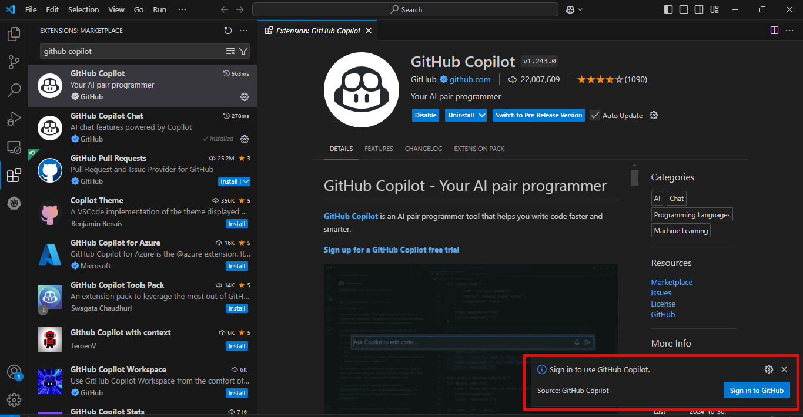
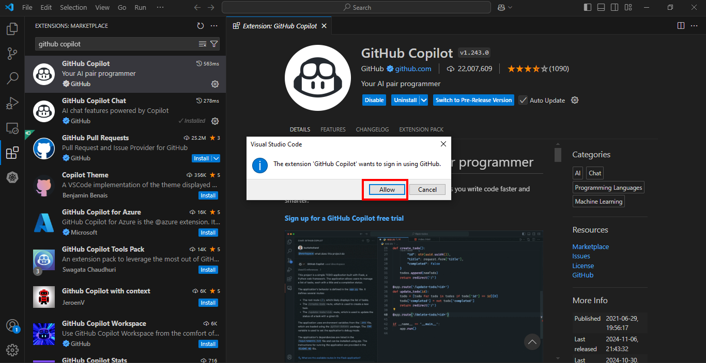
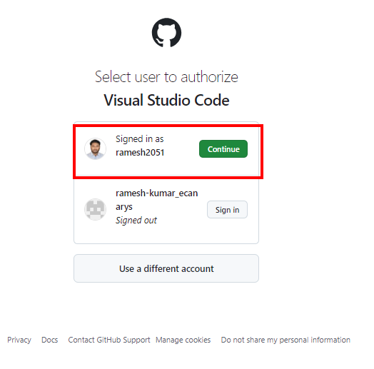
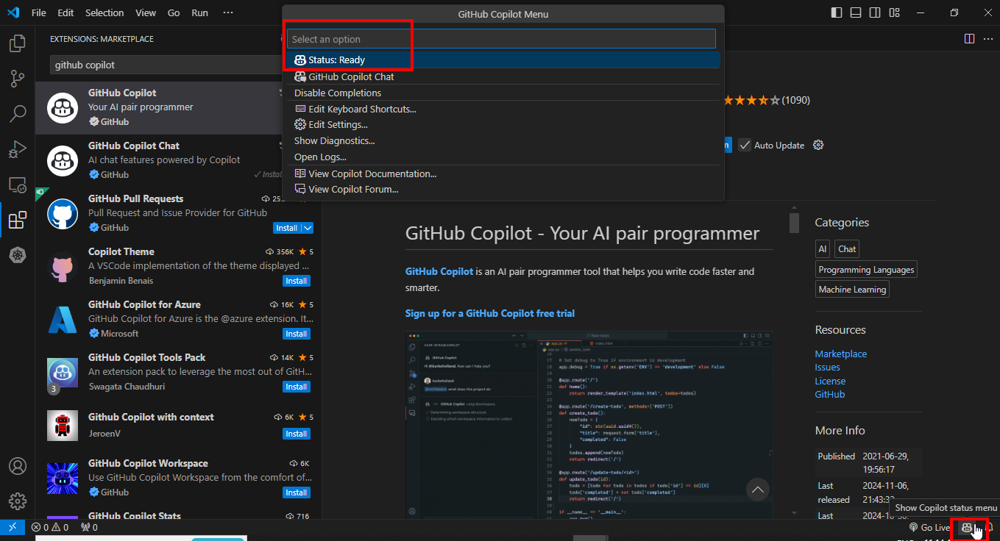

# GitHub Copilot in Visual Studio Code

GitHub CoPilot is an AI Pair Programmer, from GitHub products.  supports the developers to convert the comments or the context into code Snippets. GitHub Copilot can be managed through personal accounts with GitHub Copilot for Individuals or through organization accounts with GitHub Copilot for Business.

## Prerequisites
 
- To use GitHub Copilot you must have an active GitHub Copilot subscription
- Latest VsCode IDE must be installed on a developer's machine or GitHub CodeSpaces must be enabled

## Installing the CoPilot Extension

- From the Visual Studio Code Marketplace, search for GitHub CoPilot Extension and click on install.

  


- After Installing the Extension, sign in with your GitHub Account for activating CoPilot

  

  
- Sign in with your GitHub account which has been allocated with a CoPilot License

  

  

- Once Signed in, check if Copilot is activated

  

## Working with Copilot

### Using Comments 

### Example-1
- Create a script to start express server 
- Create a new Javascript file and add a comment to create and start the express server

  

- Press Ctrl + Enter to see all the CoPilot Suggestions. Choose the best solution 

  

  

- Test if express server can be initiated

  

  


### Example-2:
1. Create a new file **githubrepos.js**

2. Add a brief comment 
   ```
   //Desciption: This script will use github api to get the repository size from all repositories in a github organization. 
   ```

    

3. CoPilot will give suggestions on the libraries to use for running your script. Choose an appropriate inline suggestion or add your own inputs

    

4. Add variables to accept github organization name and github token as inputs to authenticate with the GitHub API

   

5. Add a comment to get the repository size. Add a function name, copilot will give suggestions on the required code to get the repository size information. Choose the appropriate inline suggestion

    

6. Add a new comment to create the csv file, copilot will populate a suggestion. Choose the required one and make changes if necessary

    

7. Copilot will automatically suggest to add lines for writing the repository data to csv file. 

    

    

    

8. Add a package.json or run npm init and install the required modules by running npm install

    

9. Run the script by running command node githubrepos.js. Check the generated csv file
    
    


## Keyboard shortcuts for GitHub Copilot
### Keyboard shortcuts for macOS

Action | Shortcut | Command name
--- | --- | ---
Accept an inline suggestion |	Tab |	editor.action.inlineSuggest.commit
Dismiss an inline suggestion |	Esc	| editor.action.inlineSuggest.hide
Show next inline suggestion	 | Option (⌥)+]| editor.action.inlineSuggest.showNext
Show previous inline suggestion	| Option (⌥)+[|editor.action.inlineSuggest.showPrevious
Trigger inline suggestion |	Option (⌥)+\ |editor.action.inlineSuggest.trigger
Open GitHub Copilot (additional suggestions in separate pane)	|Ctrl+Return	|github.copilot.generate
Toggle GitHub Copilot on/off	|No default shortcut|github.copilot.toggleCopilot

### Keyboard shortcuts for Windows

Action	|Shortcut	|Command name
--- | --- | --- 
Accept an inline suggestion	|Tab	|editor.action.inlineSuggest.commit
Dismiss an inline suggestion	|Esc	|editor.action.inlineSuggest.hide
Show next inline suggestion	|Alt+]	|editor.action.inlineSuggest.showNext
Show previous inline suggestion |	Alt+[	|editor.action.inlineSuggest.showPrevious
Trigger inline suggestion	|Alt+\	|editor.action.inlineSuggest.trigger
Open GitHub Copilot (additional suggestions in separate pane)	|Ctrl+Enter	|github.copilot.generate
Toggle GitHub Copilot on/off	|No default shortcut |github.copilot.toggleCopilot

### Keyboard shortcuts for Linux

Action	|Shortcut	|Command name
--- | --- | ---
Accept an inline suggestion	|Tab	|editor.action.inlineSuggest.commit
Dismiss an inline suggestion	|Esc	|editor.action.inlineSuggest.hide
Show next inline suggestion	|Alt+]	|editor.action.inlineSuggest.showNext
Show previous inline suggestion	|Alt+[	|editor.action.inlineSuggest.showPrevious
Trigger inline suggestion	|Alt+\	|editor.action.inlineSuggest.trigger
Open GitHub Copilot (additional suggestions in separate pane)	|Ctrl+Enter	|github.copilot.generate
Toggle GitHub Copilot on/off	|No default shortcut |github.copilot.toggleCopilot

## Slash commands

`/tests`: Generate unit tests for the selected code
`/fix`: Propose a fix for problems in the selected code  
`/explain`: Explain the selected code  
`/clear`: Start a new chat
`@workspace`: Has context about the code in your workspace. Use `@workspace` when you want Copilot to consider the structure of your project, how different parts of your code interact, or design patterns in your project.
`@vscode`: Has context about Visual Studio Code commands and features. Use `@vscode` when you want help with Visual Studio Code.
`@terminal`: Has context about the Visual Studio Code terminal shell and its contents. Use `@terminal` when you want help creating or debugging terminal commands.
`@azure`: Has context about Azure services and how to use, deploy and manage them. Use `@azure` when you want help with Azure. The @azure chat participant is currently in public preview and is subject to change.

## Chat variables

Use chat variables to include specific context in your prompt. To use a chat variable, type `# ` in the chat prompt box, followed by a chat variable. Chat variables include:
`#file`: Include a specific file as context in the chat.
`#git`: Include information about the current Git repository.
`#terminalLastCommand`: Include the last run command in the active Visual Studio Code terminal.